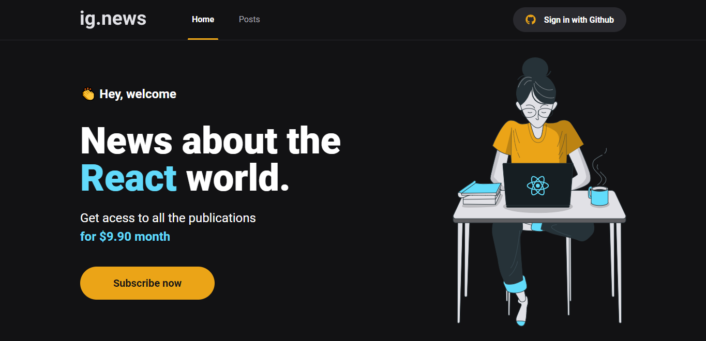

# ig.news 🗞

O projeto `ig.news` busca o aprendizado do
framework `NextJS`, abordando de ponta a ponta
as funcionalidades mais usadas da ferramenta:

- Server Side Rendering
- Next Routing
- Serverless- API Routes

### API Serverless

O NextJS possui a funcionalidade de API
routes, que usa o modelo de serverless
para execução de uma espécie de backend
feita no frontend.

Serverless é um modelo de desenvolvimento
nativo da nuvem que permite que os
desenvolvedores criem e executem aplicativos
sem precisar gerenciar servidores.

Para criação do banco de dados do `ig.news`
optou-se pela utilização do banco de dados
**FaunaDB**.

A ferramenta em questão é
recomendada pela própria empresa do NextJS,
a Vercel, e possui uma documentação e API
mais simples, além de uma melhor precificação se comparado com as outras
alternativas do mercado, como por exemplo o DynamoDB da AWS.
